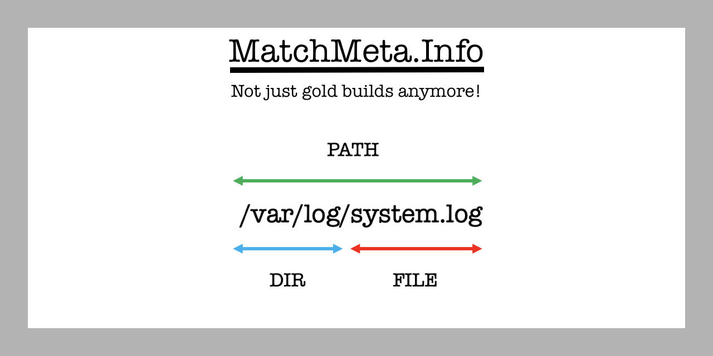

Amazon Web Services (AWS) regularly releases new Amazon Machine Images (AMI) for Amazon Linux, requiring the generation of digital artifacts necessary for cybersecurity investigations. 

Amazon-owned AMI names that start with ```amazon/amzn``` or ```amazon/al2022``` and may end with ```-gp2``` will be launched into a temporary VPC in Oregon (US-WEST-2) region to automatically collect the ```System.map``` file and run the ```getmeta``` collection script for ```x86_64``` and ```arm64``` architecture.

https://github.com/4n6ir/getmeta

This enrichment option allows the analyst to take traditional hashing a step further by knowing which directories, files, and paths are standard for specific releases of the Amazon Linux distribution.

```python

import requests

key = ''
url = 'https://sha256.lukach.io' # https://md5.lukach.io

headers = {'x-api-key': key}

r = requests.get(url, headers = headers)

output = r.json()

d = requests.get(output['link'])

if d.status_code == 200:
   with open(output['filename'], 'wb') as f:
     f.write(d.content)

```
